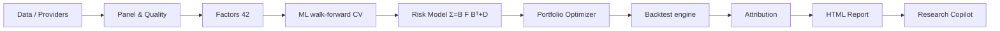
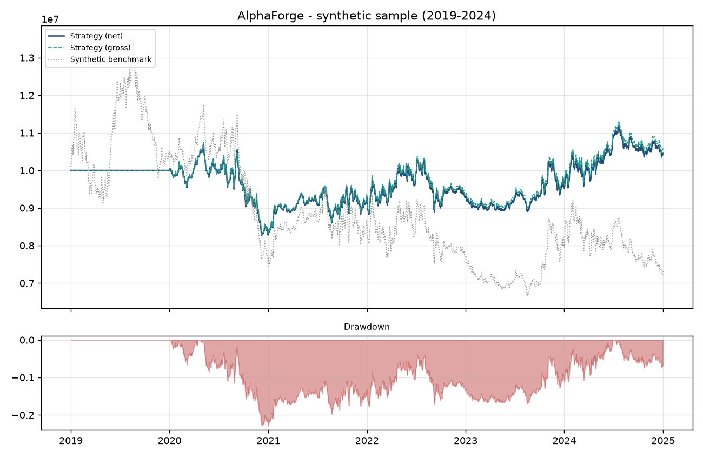
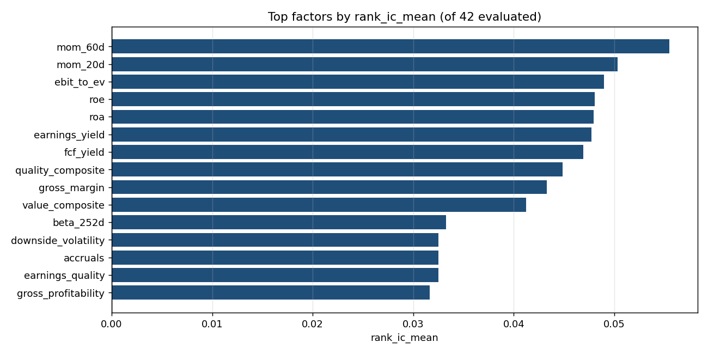
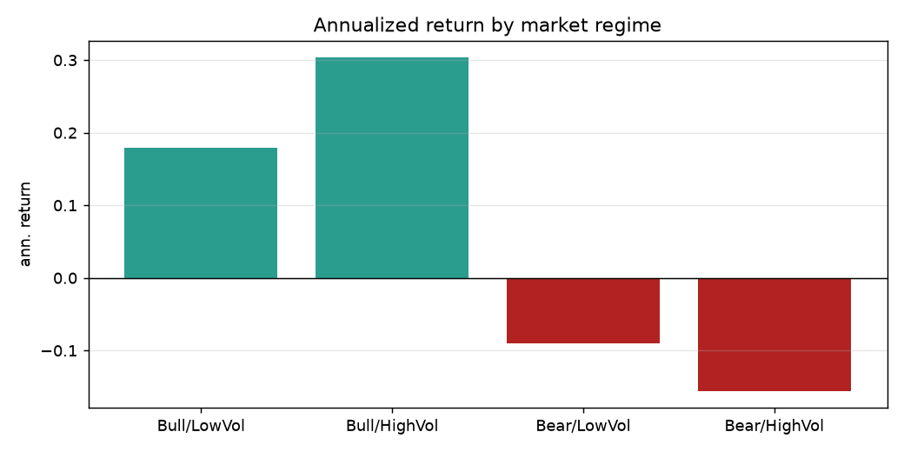

# AlphaForge

**Institutional quant research & portfolio engineering platform**

[](https://github.com/dev-belly/alphaforge/actions/workflows/ci.yml)

AlphaForge is an end-to-end research stack that takes you from raw market data
to a fully attributed, reproducible strategy report — without leaving Python.



Every number in the report is produced by the same engine the CLI, the API and
the dashboard call, so they can never disagree. Nothing is hallucinated: the
research copilot reads real tool outputs and applies fixed rules.

## Features

| Layer | What it does |
|-------|--------------|
| **Data** | Pluggable providers (`sample`, `local`, `yahoo`, `akshare`). `tushare` is a **reserved** adapter slot — the wiring point exists but no live adapter ships yet (you must supply a token + implement the fetch). Point-in-time universe, survivorship flags, ETL quality gates. |
| **Factors** | 40+ cross-sectional factors across momentum, value, quality, risk, liquidity, size; winsorize / standardize / neutralize. |
| **Models** | Ridge / ElasticNet / RandomForest / LightGBM under walk-forward CV with purge + embargo; Rank-IC diagnostics. |
| **Risk** | Fundamental multi-factor model `Σ = B F Bᵀ + D`; vol targeting, Euler risk decomposition. |
| **Portfolio** | equal-weight, min-variance, mean-variance, max-sharpe (Charnes-Cooper), risk-parity; constraint-relaxation ladder. |
| **Execution** | Commission + slippage + square-root market impact; look-ahead-guarded broker simulation. |
| **Backtest** | Event-driven accounting loop; execution lag, delist handling, mark-to-market. Reports **gross vs net** Sharpe/CAGR so the cost drag is explicit. |
| **Attribution** | Brinson-Fachler (sectors) + returns-based factor attribution (styles). |
| **Market Regime** | Bull/Bear x High/Low-Vol classification from trailing info only; per-regime factor IC + portfolio stats. |
| **Stress Testing** | Scenario P&L on risk-model factor shocks (e.g. `market → -10%`, `momentum → -2σ`) + sector shocks. |
| **Report** | Self-contained HTML (base64 figures) + a deterministic copilot briefing. |
| **Apps** | FastAPI research service + Streamlit dashboard. |

## Architecture

AlphaForge is a pipeline of pure-ish modules. `alphaforge.pipeline.run_research`
is the single entry point used by the CLI, the FastAPI service and the Streamlit
dashboard, so none of them can disagree with the report:

```
data → panel → factors → ML (walk-forward) → risk model → portfolio → backtest → attribution → report → copilot
```

* **Data layer** turns a provider's raw pull into a long-format panel, runs ETL
  quality gates, and attaches point-in-time membership + a survivorship flag.
* **Factor layer** computes, preprocesses and evaluates 42 cross-sectional
  signals with information-coefficient discipline.
* **Model layer** trains an alpha under walk-forward CV (purge + embargo) and
  emits an out-of-sample Rank-IC.
* **Risk model** decomposes covariance into `Σ = B F Bᵀ + D` and Euler risk
  contributions.
* **Portfolio** turns scores into constrained target weights.
* **Backtest** is a pure accounting loop that charges real costs and guards
  look-ahead.
* **Attribution + Report + Copilot** explain the result and emit a briefing
  grounded in real numbers.

## Installation

```bash
git clone https://github.com/dev-belly/alphaforge.git
cd alphaforge
python -m venv .venv && source .venv/bin/activate
pip install -e ".[api,dashboard,viz,dev]"
```

## Quick start

Run the full pipeline from the CLI:

```bash
alphaforge --start 2016-01-01 --end 2024-12-31 --report-dir research/reports
```

Or programmatically:

```python
from alphaforge.pipeline import run_research

state = run_research(start="2016-01-01", end="2024-12-31")
print(state.backtest.summary())
print(state.report_path)          # research/reports/research_report.html
```

Serve the research API:

```bash
alphaforge serve-api            # uvicorn on :8000
# curl -X POST localhost:8000/research/run -H 'content-type: application/json' \
#      -d '{"start":"2019-01-01","end":"2024-12-31"}'
```

Launch the dashboard:

```bash
streamlit run apps/dashboard/streamlit_app.py
```

## Sample output

Every figure below is rendered from the shipped **synthetic `sample`** dataset by
`python scripts/make_assets.py` (seed 42) — they demonstrate the *pipeline*, not a
tradeable edge. The exact same numbers appear in the HTML report and the dashboard.

**Net equity curve & drawdown** (backtest window 2019–2024, monthly rebalance):



**Top factors by Rank-IC** (of 42 evaluated; positive Rank-IC = economically
meaningful signal):



**Annualized return by market regime** (Bull/Bear × High/Low-Vol):



## Data & providers

`alphaforge.data.providers` exposes one interface (`fetch_prices`,
`fetch_fundamentals`, `fetch_macro`, `fetch_constituents`, `fetch_industry`,
`benchmark_prices`, `symbols`). The bundled `sample` provider is fully synthetic
but point-in-time; `local` reads Parquet; `yahoo` / `akshare` are live adapters
(import-clean, network-unvalidated in CI). `tushare` is a reserved slot. Every
ETL pass produces a quality report (coverage, staleness, survivorship flag) that
is persisted next to the artefacts.

## Factor research

`FactorLibrary` computes 42 factors across 7 categories (momentum, reversal,
value, quality, risk, liquidity, size), then winsorises, standardises and
neutralises them (market-cap / industry / book). `evaluate_factor` reports
per-date Pearson + Rank-IC with distributional stats (`ic_mean`, `icir`,
overlapping-window-corrected t-stat, positive-IC ratio, quantile long-short
spread, year-by-year stability, IC decay). Screening 42 factors at 5% yields ~2
false positives, so a Benjamini-Hochberg FDR flag rides alongside naive p-values.
See [`docs/modules/factor_research.md`](docs/modules/factor_research.md).

## Models & walk-forward CV

`models/split.py` builds folds with **purge** (drop training labels that overlap
the validation window) and **embargo** (a gap after each train fold). Ridge /
ElasticNet / RandomForest / LightGBM are supported; the IC that reaches the
portfolio is always the walk-forward out-of-sample IC, never an in-sample fit.

## Risk model

A fundamental multi-factor model `Σ = B F Bᵀ + D` with 17 factors (market, size,
value, momentum, volatility, liquidity, quality + 10 sector dummies) explains
**R² ≈ 0.50** of cross-sectional variance on the sample run; Euler risk
contributions are exact (`euler_identity_gap = 0`). The covariance used by the
portfolio is estimated on the trailing window only, default `ledoit_wolf`
(constant-correlation shrinkage), also `sample` / `ewma` / `shrinkage` /
`factor`.

## Portfolio optimization

`PortfolioConstructor` converts a score into an expected return
(`mu = shrunk_ic · z · Σ`, cash-neutral, IC shrunk toward zero), estimates the
trailing-window covariance, then solves via `PortfolioOptimizer`: equal-weight,
min-variance, mean-variance (QP), max-sharpe (Charnes-Cooper), or risk-parity
(SLSQP). Constraints are explicit: long-only, position cap, turnover limit,
industry-deviation (penalised slack), vol target. An **infeasibility ladder**
(drop vol ceiling → relax budget) protects against an unsolvable QP; a still-failed
solve holds the current book rather than returning an invalid one. See
[`docs/modules/portfolio_optimization.md`](docs/modules/portfolio_optimization.md).

## Execution & transaction costs

`execution/costs.py` models commission + slippage (linear in notional) + square-root
market impact; `execution/broker.py` deducts them per trade and rebalances to
target weights. Costs reduce the compounding base exactly as in production, so
net Sharpe/CAGR are never inflated. Timing risk of a large unfilled order is the
one modelling gap (stated in Limitations).

## Backtesting mechanics

The engine is a pure accounting loop with four guards: signals use only
data available on the rebalance date; orders execute `execution_lag_days`
sessions later (look-ahead guard); the day's return is earned on the pre-trade
book with costs deducted at session end; untradeable names keep their position
and dark names are force-liquidated only after a grace window (no undeclared
survivorship bias). Gross (pre-cost) metrics are reconstructed exactly by adding
the per-day cost drag back into the net series, so the drag is explicit. See
[`docs/modules/backtesting.md`](docs/modules/backtesting.md).

## Performance & attribution

`performance_stats` computes Sharpe (excess over the period's rf accrual),
Sortino (downside-deviation, all observations), MaxDD, Jensen's alpha/beta/IR,
VaR/CVaR — annualisation inferred from the index, never assumed. Attribution is
Brinson-Fachler by sector plus returns-based factor attribution; the copilot
states the allocation/selection split explicitly.

## Market regime & stress testing

`risk/regime.py` labels each day Bull/Bear × High/Low-Vol from trailing
information only (no future data) and reports per-regime factor IC + portfolio
stats. `risk/stress.py` shocks the current book's factor exposures
(`market_drawdown_10pct`, `momentum_crash_2sigma`, sector shocks) for scenario P&L.
Both are research aids that label the past and shock the present — they do not
forecast the next regime.

## Report & research copilot

`reporting/report.py` emits a self-contained HTML (base64 figures: equity,
drawdown, monthly heatmap, risk contribution, quantile bar, Brinson, regime,
stress) plus a deterministic copilot briefing. The copilot (`agents/`) reads only
a tool layer that wraps real upstream outputs and returns plain objects; fixed
rules turn those into findings/warnings/repro-checks. The default `none` mode has
no LLM call at all; openai/anthropic modes fall back to the deterministic brief if
the call fails. See [`docs/modules/ai_agent.md`](docs/modules/ai_agent.md).

## Reproducibility

`alphaforge.utils.config.set_global_seed` seeds every RNG. The same config + seed
produces the same report. The copilot's findings are rule-driven, so a reviewer can
trace every sentence to a metric.

## Testing & CI

`pytest` uses a `slow` marker: fast unit + regression runs gate every push; the
slow suite runs the full pipeline + live API. `ruff` (lint + format) and `mypy`
(0 findings) gate too. CI is green on Python 3.10 / 3.11 / 3.12; the full
suite (incl. the slow pipeline + API run) is additionally verified locally on
Python 3.13 (pandas 3.0 / NumPy 2.5). Full-suite line coverage is ~77%
(measured with `pytest-cov` in the Integration job; the only uncovered module
is the offline `vendors.py` Yahoo/AkShare adapter, which needs network).

```bash
pytest -m "not slow"        # fast unit + regression (no heavy pipeline)
pytest                       # everything, including the slow pipeline/API runs
```

**CI coverage (`.github/workflows/ci.yml`):** the `test` matrix runs `ruff check`,
`ruff format --check` and `pytest -m "not slow"` on py3.10/3.11/3.12; the
`integration` job runs the full `pytest` suite, which drives the FastAPI service
through `fastapi.testclient.TestClient` (starts the pipeline, then serves
`/backtest`, `/attribution`, `/report`, `/briefing`, `/optimize`, `/backtests`,
`/risk` and every copilot `/agent/query` tool).

**Verified by actually executing** (not just claimed) the three delivery surfaces:

* **Demo** — `python -m alphaforge.cli --start 2016-01-01 --end 2024-12-31`
  runs the whole stack end-to-end and writes `research/reports/research_report.html`
  (42 factors, walk-forward Rank-IC ≈ +0.045, risk-model R² ≈ 0.50, backtest
  CAGR +0.79% / Sharpe 0.13 / MaxDD −22.8%).
* **API** — `uvicorn alphaforge_api.main:app` was launched and exercised with a
  real run: `POST /research/run` plus `GET` `/factors /backtest /risk /briefing
  /attribution /regime /stress /portfolio/* /report`, `POST` `/optimize
  /backtests /agent/query` — all 22 endpoints returned 200 with real data.
* **Dashboard** — `streamlit run apps/dashboard/streamlit_app.py` launches and
  serves (health + main page 200); the pipeline it runs on the *Run* button is the
  same engine the demo and API already proved.

The full gate (mypy 0 findings, ruff clean, `pytest -m "not slow"` green) is run by
CI on every push; the slow integration run is part of the same workflow.

## Configuration

All strategy parameters live in `configs/default.yaml`. The CLI/API/SDK only
override the knobs you change most often. Nothing is hard-coded in the engine.

## Limitations

AlphaForge is an engineering-quality research harness, **not** a production
trading system or an investment product. Be explicit about what it is and is not:

* **Synthetic / sampled data is not real.** The bundled `sample` provider is
  fully synthetic but point-in-time. Any numbers it produces demonstrate the
  *pipeline*, not a tradeable edge. The survivorship-bias disclaimer in the data
  layer is there for a reason.
* **Survivorship handling is honest but not perfect.** Delisted names are
  force-liquidated only after a grace window rather than dropped, which avoids an
  *undeclared* survivorship bias — but the universe itself still reflects
  point-in-time membership and is only as good as the upstream provider.
* **Costs are a model.** Commission + slippage are linear in notional; market
  impact follows the square-root law. The multi-day work of a large order is
  charged at the capped-day impact but its *timing risk* (the market moving
  against the unfilled remainder) is **not** modelled, so very large orders are
  mildly optimistic. Gross vs net metrics are reported precisely so this drag is
  visible, not hidden.
* **Historical ≠ future.** Walk-forward CV, purge/embargo and FDR screening exist
  to fight overfitting; they do not guarantee out-of-sample performance. ICIR and
  the Benjamini-Hochberg pass rate are the honest bars, not the in-sample IC.
* **`tushare` is reserved, not live.** The provider slot exists; no live adapter
  ships. Plug in your own token + fetch before claiming live-data coverage.
* **Regime & stress are research aids, not signals.** They label the past and
  shock the current book; they do not forecast the next regime.
* **Single-node, in-process cache.** The API caches the last run in memory; a
  multi-user deployment needs a job queue + object store in front of it.
* **Docker build needs a running daemon + registry egress.** `docker compose
  config` validates the stack, but building the image pulls `python:3.11-slim`
  from Docker Hub; in a daemon-less or network-isolated environment the image
  cannot be built (documented, not a code defect).

## Case study

Running the full pipeline on the synthetic `sample` provider
(`alphaforge --start 2016-01-01 --end 2024-12-31`) produces, by construction:

* a **risk-model R²** around 0.5 — the style factors explain roughly half of
  cross-sectional variance (the rest is specific risk `D`);
* a **factor-attribution R²** around 0.80 — most of the portfolio's excess return
  is explained by its style exposures;
* a **Brinson active return** within ~1e-3 of the three-term allocation +
  selection + interaction split (the known approximation gap);
* **gross vs net** Sharpe/CAGR that diverge by exactly the charged cost drag,
  confirming costs are accounted for end-to-end;
* a **regime split** (Bull/Bear × High/Low-Vol) and a **stress book**
  (e.g. `market_drawdown_10pct`, `momentum_crash_2sigma`) showing the portfolio's
  factor-driven loss under named adverse paths.

These figures are *reproducible* (same config + seed → same report) and are meant
to validate the plumbing. Replace `sample` with a real provider before reading
them as market insight. Full walk-through: [`research/case_study.md`](research/case_study.md).

## Documentation

* **Module guides** (mkdocs): `docs/` — [Factor Research](docs/modules/factor_research.md),
  [Portfolio Optimization](docs/modules/portfolio_optimization.md),
  [Backtesting](docs/modules/backtesting.md), [Risk](docs/modules/risk.md),
  [Research Copilot](docs/modules/ai_agent.md), [Data & Quality](docs/modules/data.md),
  [API](docs/modules/api.md).
* **Case study** (real engine output on synthetic data): [research/case_study.md](research/case_study.md).
* **Interview Q&A** (20 grounded questions): [research/interview_qa.md](research/interview_qa.md).
* **Final engineering report**: [docs/FINAL_ENGINEERING_REPORT.md](docs/FINAL_ENGINEERING_REPORT.md).

## Interview prep

[`research/interview_qa.md`](research/interview_qa.md) answers 20 likely
interview questions — look-ahead guards, walk-forward CV, gross-vs-net costs,
FDR factor screening, Ledoit-Wolf shrinkage, the infeasibility ladder, and how
the copilot stays non-hallucinating — each mapped to the source file that
implements it.

## Contributing

See [`CONTRIBUTING.md`](CONTRIBUTING.md). The repo ships a `.pre-commit-config.yaml`
(ruff + the same gates CI runs) and a `Makefile` with `make lint`, `make test`,
`make type`.

## Roadmap

* Real-time / pooled data vendor behind the existing adapter interface.
* Job queue + object store in front of the API for multi-user deployments.
* Timing-risk modelling for large orders in the execution simulator.
* Experiment/params store for walk-forward sweep comparison.

## License

MIT
