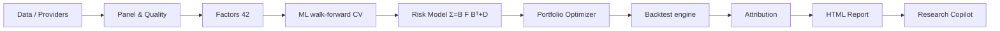

# AlphaForge

**Python toolkit for factor research, portfolio construction, and backtesting**

[](https://github.com/dev-belly/alphaforge/actions/workflows/ci.yml)

AlphaForge is an end-to-end research stack that takes you from raw market data
to a fully attributed, reproducible strategy report — without leaving Python.



The CLI, API and dashboard share a research pipeline, and the report reads its
outputs. The default research copilot summarizes tool outputs with fixed rules.
Matching data, configuration, seed and dependency versions are needed to compare
results across runs.

[Documentation](https://dev-belly.github.io/alphaforge/) · [Sample report](https://dev-belly.github.io/alphaforge/sample/research_report.html) · [Reproduction record](https://dev-belly.github.io/alphaforge/sample-run/)

## Features

| Layer | What it does |
|-------|--------------|
| **Data** | Pluggable providers (`sample`, `local`, `yahoo`, `akshare`). `tushare` is a **reserved** adapter slot — the wiring point exists but no live adapter ships yet (you must supply a token + implement the fetch). Point-in-time universe, survivorship flags, ETL quality gates. |
| **Factors** | 40+ cross-sectional factors across momentum, value, quality, risk, liquidity, size; winsorize / standardize / neutralize. |
| **Models** | Ridge / ElasticNet / RandomForest / LightGBM under walk-forward CV with purge + embargo; Rank-IC diagnostics. |
| **Risk** | Fundamental multi-factor model `Σ = B F Bᵀ + D`; vol targeting, Euler risk decomposition. |
| **Portfolio** | equal-weight, min-variance, mean-variance, max-sharpe (Charnes-Cooper), risk-parity; constraint-relaxation ladder. |
| **Execution** | Commission + slippage + square-root market impact; look-ahead-guarded broker simulation. |
| **Backtest** | Event-driven accounting loop; execution lag, delist handling, mark-to-market. Reports **gross vs net** Sharpe/CAGR so the cost drag is explicit. |
| **Attribution** | Brinson-Fachler (sectors) + returns-based factor attribution (styles). |
| **Market Regime** | Bull/Bear x High/Low-Vol classification from trailing info only; per-regime factor IC + portfolio stats. |
| **Stress Testing** | Scenario P&L on risk-model factor shocks (e.g. `market → -10%`, `momentum → -2σ`) + sector shocks. |
| **Report** | Self-contained HTML (base64 figures) + a deterministic copilot briefing. |
| **Apps** | FastAPI research service + Streamlit dashboard. |

## Tech stack

| Layer | Tools used here |
|---|---|
| Research and data | Python 3.10+, pandas, NumPy, SciPy, statsmodels, scikit-learn, LightGBM; Parquet and DuckDB |
| Portfolio and reporting | CVXPY for constrained optimisation; Matplotlib / Plotly for figures and self-contained HTML reports |
| Interfaces | CLI, FastAPI + Pydantic research API, Streamlit dashboard |
| Quality and delivery | pytest, ruff, mypy, GitHub Actions; optional Docker Compose for the local API and dashboard |

## Architecture

AlphaForge is a pipeline of pure-ish modules. The CLI, FastAPI service and
Streamlit dashboard use `alphaforge.pipeline.ResearchPipeline.run` to run the
same research stages:

```
data → panel → factors → ML (walk-forward) → risk model → portfolio → backtest → attribution → report → copilot
```

* **Data layer** turns a provider's raw pull into a long-format panel, runs ETL
  quality gates, and attaches point-in-time membership + a survivorship flag.
* **Factor layer** computes, preprocesses and evaluates 42 cross-sectional
  signals with information-coefficient discipline.
* **Model layer** trains an alpha under walk-forward CV (purge + embargo) and
  emits an out-of-sample Rank-IC.
* **Risk model** decomposes covariance into `Σ = B F Bᵀ + D` and Euler risk
  contributions.
* **Portfolio** turns scores into constrained target weights.
* **Backtest** is a pure accounting loop that charges real costs and guards
  look-ahead.
* **Attribution + Report + Copilot** explain the result and emit a briefing
  grounded in real numbers.

## Installation

```bash
git clone https://github.com/dev-belly/alphaforge.git
cd alphaforge
python -m venv .venv && source .venv/bin/activate
pip install -e ".[api,dashboard,viz,dev]"
```

## Quick start

Run the full pipeline from the CLI:

```bash
alphaforge --start 2016-01-01 --end 2024-12-31 --report-dir research/reports
```

Or programmatically:

```python
from alphaforge.pipeline import run_research

state = run_research(start="2016-01-01", end="2024-12-31")
print(state.backtest.summary())
print(state.report_path)  # research/reports/research_report.html
```

Serve the research API:

```bash
alphaforge --serve-api          # uvicorn on :8000
# curl -X POST localhost:8000/research/run -H 'content-type: application/json' \
#      -d '{"start":"2019-01-01","end":"2024-12-31"}'
```

Launch the dashboard:

```bash
streamlit run apps/dashboard/streamlit_app.py
```

For the two-service local container stack, run `docker compose up --build`.
The API is at `http://127.0.0.1:8000/health` and the dashboard at
`http://127.0.0.1:8501`. The CLI binds to loopback by default; Compose passes
`--api-host 0.0.0.0` **inside** the container and publishes both ports only on
the host's loopback interface. The research API is a local demo without user
authentication.

## Sample output

Every figure below is rendered from the shipped **synthetic `sample`** dataset by
`python scripts/publish_sample.py` (seed 42) — they demonstrate the *pipeline*, not a
tradeable edge. Reports from other dates, configurations or dependency versions
can differ from these checked-in figures.

**Net equity curve & drawdown** (backtest window 2019–2024, monthly rebalance):


**Top factors by Rank-IC** (of 42 evaluated; positive Rank-IC indicates a
positive rank association with forward returns on the synthetic sample):


**Annualized return by market regime** (Bull/Bear × High/Low-Vol):


## Data & providers

`alphaforge.data.providers` exposes one interface (`fetch_prices`,
`fetch_fundamentals`, `fetch_macro`, `fetch_constituents`, `fetch_industry`,
`benchmark_prices`, `symbols`). The bundled `sample` provider is fully synthetic
but point-in-time; `local` reads Parquet; `yahoo` / `akshare` are live adapters.
Their parsing, column-mapping and failure handling are unit-tested **offline**
against injected fakes (`tests/unit/test_vendors.py`, 100% on `vendors.py`); only
the live HTTP path is unvalidated, because CI has no egress. `tushare` is a
reserved slot. Every
ETL pass produces a quality report (coverage, staleness, survivorship flag) that
is persisted next to the artefacts.

## Factor research

`FactorLibrary` computes 42 factors across 7 categories (momentum, reversal,
value, quality, risk, liquidity, size), then winsorises, standardises and
neutralises them (market-cap / industry / book). `evaluate_factor` reports
per-date Pearson + Rank-IC with distributional stats (`ic_mean`, `icir`,
overlapping-window-corrected t-stat, positive-IC ratio, quantile long-short
spread, year-by-year stability, IC decay). Screening 42 factors at 5% yields ~2
false positives, so a Benjamini-Hochberg FDR flag rides alongside naive p-values.
See [`docs/modules/factor_research.md`](docs/modules/factor_research.md).

## Models & walk-forward CV

`models/split.py` builds folds with **purge** (drop training labels that overlap
the validation window) and **embargo** (a gap after each train fold). Ridge /
ElasticNet / RandomForest / LightGBM are supported. Walk-forward Rank-IC is an
evaluation metric; the portfolio uses a fixed `portfolio.assumed_ic` set before
the run. Using the full evaluation IC at earlier rebalances would leak future
test returns.

## Risk model

A fundamental multi-factor model `Σ = B F Bᵀ + D` with 17 factors (market, size,
value, momentum, volatility, liquidity, quality + 10 sector dummies) explains
**R² ≈ 0.50** of cross-sectional variance on the sample run; Euler risk
contributions are exact (`euler_identity_gap = 0`). The covariance used by the
portfolio is estimated on the trailing window only, default `ledoit_wolf`
(constant-correlation shrinkage), also `sample` / `ewma` / `shrinkage` /
`factor`.

## Portfolio optimization

`PortfolioConstructor` converts a score into an expected return
(`mu = shrunk_ic · z · sigma`, cash-neutral, IC shrunk toward zero), estimates the
trailing-window covariance, then solves via `PortfolioOptimizer`: equal-weight,
min-variance, mean-variance (QP), max-sharpe (Charnes-Cooper), or risk-parity
(SLSQP). Constraints are explicit: long-only, position cap, turnover limit,
industry-deviation (penalised slack), vol target. An **infeasibility ladder**
(drop vol ceiling → relax budget) protects against an unsolvable QP; a still-failed
solve holds the current book rather than returning an invalid one. See
[`docs/modules/portfolio_optimization.md`](docs/modules/portfolio_optimization.md).

## Execution & transaction costs

`execution/costs.py` models commission + slippage (linear in notional) + square-root
market impact; `execution/broker.py` deducts them per trade and rebalances to
target weights. The simulator deducts modeled costs from portfolio cash and
reports their effect on net returns. Execution and market-impact assumptions
remain approximations; timing risk from unfilled orders is discussed in
Limitations.

## Backtesting mechanics

The engine is a pure accounting loop with four guards: signals use only
data available on the rebalance date; orders execute `execution_lag_days`
sessions later (look-ahead guard); the day's return is earned on the pre-trade
book with costs deducted at session end; untradeable names keep their position
and dark names are force-liquidated only after a grace window (no undeclared
survivorship bias). Gross (pre-cost) metrics are reconstructed exactly by adding
the per-day cost drag back into the net series, so the drag is explicit. See
[`docs/modules/backtesting.md`](docs/modules/backtesting.md).

## Performance & attribution

`performance_stats` computes Sharpe (excess over the period's rf accrual),
Sortino (downside-deviation, all observations), MaxDD, Jensen's alpha/beta/IR,
VaR/CVaR — annualisation inferred from the index, never assumed. Attribution is
Brinson-Fachler by sector plus returns-based factor attribution; the copilot
states the allocation/selection split explicitly.

## Market regime & stress testing

`risk/regime.py` labels each day Bull/Bear × High/Low-Vol from trailing
information only (no future data) and reports per-regime factor IC + portfolio
stats. `risk/stress.py` shocks the current book's factor exposures
(`market_drawdown_10pct`, `momentum_crash_2sigma`, sector shocks) for scenario P&L.
Both are research aids that label the past and shock the present — they do not
forecast the next regime.

## Report & research copilot

`reporting/report.py` emits a self-contained HTML (base64 figures: equity,
drawdown, monthly heatmap, risk contribution, quantile bar, Brinson, regime,
stress) plus a deterministic copilot briefing. The copilot (`agents/`) reads only
a tool layer that wraps real upstream outputs and returns plain objects; fixed
rules turn those into findings/warnings/repro-checks. The default `none` mode has
no LLM call at all; openai/anthropic modes fall back to the deterministic brief if
the call fails. See [`docs/modules/ai_agent.md`](docs/modules/ai_agent.md).

## Reproducibility

`alphaforge.utils.config.set_global_seed` seeds every RNG. The same config + seed
is intended to reproduce numeric results with matching data and dependencies;
the report includes a generation timestamp. The copilot's findings are rule-driven, so a reviewer can
trace every sentence to a metric.

## Testing & CI

`pytest` uses a `slow` marker: fast unit + regression runs gate every push; the
slow suite runs the full pipeline + live API. `ruff` (lint + format) and `mypy`
(0 findings) gate too. CI is green on Python 3.10 / 3.11 / 3.12; the full
suite (incl. the slow pipeline + API run) is additionally verified locally on
Python 3.13 (pandas 3.0 / NumPy 2.5). Full-suite line coverage is 97% locally
(measured with `pytest-cov` over the whole suite, slow tests included; the CI
Integration job measures its own subset). Every module is above 85%, the lowest
being `factors/base.py`; the remaining gaps are concentrated in the execution and
optimiser paths, which the slow suite drives only along their happy path.
Anything that cannot be exercised for real is exercised against fakes instead:

* `yahoo` / `akshare` — parsing, column mapping and failure handling are tested
  offline (100% on `vendors.py`) with fakes injected into `sys.modules`. The live
  HTTP path has since been exercised by hand from a machine with egress, on
  2026-09-26:
  * **`eastmoney`** (the key-less A-share backend, so the `akshare` slot needs no
    SDK) fetched real data - two symbols over nine sessions, all eleven canonical
    columns, `600519` closing at 1505.05 on 2024-06-03, with `market_cap` NaN and
    `industry` `Unknown` exactly as its docstring documents.
  * the **failure** path was confirmed live rather than only against fakes: a
    blocked request produced per-symbol warnings, an empty canonical frame, and
    then `RuntimeError: Provider eastmoney returned an empty price panel` from
    `DataPipeline` - the hard-failure contract, end to end.
  * **`yahoo`** constructs, imports `yfinance` and reaches the network, but Yahoo
    rate-limits this egress (`YFRateLimitError`), so no live rows were fetched
    from it. Egress to the EastMoney host is also intermittent - a later
    identical request failed - so this is a validated path, not a reliable one.
* `cli` — argument parsing, symbol normalisation and the API-server branch are
  tested in-process with a fake pipeline (97%); the real end-to-end run is
  covered by the slow integration test.
* `local` — the Parquet backend is tested against a `tmp_path` store (100%),
  including the universe it reports to the ETL from persisted artefacts.
* `pipeline` — the ETL entry point is driven through a fake provider (100%):
  universe resolution, the empty-panel hard failure, benchmark-as-returns, the
  persisted-bundle round trip, the quality-gate warning, and the persist /
  reload paths for non-empty fundamentals, macro and constituents.
* `storage` — the Parquet store and its DuckDB surface are exercised against a
  `tmp_path` (100%), including the incremental upsert that must correct a
  `(date, symbol)` bar in place rather than duplicate it.
* `providers` — the config-driven factory is covered for every alias (100%), so a
  typo in the provider setting raises an actionable error instead of silently
  running against the wrong backend.
* `features` — the wide panel that every factor, model, optimiser and backtest
  consumes is locked offline (100% on `panel.py`): returns come from **adjusted**
  prices and a price gap is never filled, a missing source column yields an
  all-NaN **float** panel rather than an object one that silently breaks every
  downstream comparison and rolling window, a substituted market cap is
  disclosed in `metadata["market_cap_source"]` (and admitted as `unavailable`
  when even the dollar-volume proxy is empty), the universe is reindexed onto the
  panel *and* masked by having a price, and   a price table without `adj_close`
  fails loudly instead of producing a zero-breadth panel. The point-in-time
  fundamentals layer is locked too (100% on `fundamentals.py`): a statement is
  invisible before its `report_date` and visible from it on, and `fiscal_period`
  is never a join key, so a February filing cannot leak into January; the
  staleness guard retires a release once it is older than `max_staleness_days`
  while `staleness()` keeps reporting its true age as a diagnostic; a ratio
  divides a point-in-time numerator by a point-in-time denominator (or by the
  market cap *of the signal date*), and a zero or overflowing denominator becomes
  NaN instead of poisoning the cross-section. The market-cap alignment returns
  values in the **caller's row order** - `merge_asof` needs a report-date sort
  that the caller needs undone, and skipping the restore gave every statement the
  market cap of whichever symbol happened to report nearby. Enterprise value is
  derived from debt alone: gating it on `total_equity` as well made `ebit_to_ev`
  (which declares `fundamental:ebit,total_debt,market_cap`) silently all-NaN for
  any provider reporting debt without equity.
* `factors` — the cross-sectional preprocessing chain is locked offline (100% on
  `preprocessing.py`): per-date winsorization / z-scoring / ranking, and
  Frisch-Waugh-Lovell industry + size neutralisation asserted by **orthogonality**
  rather than by "it ran". Unscored names must keep the neutral fill value, never
  a residual invented from their size. The risk / volatility factors are locked
  too (100% on `risk.py`), with every expectation computed independently - an
  explicit numpy slice per rolling window, and return series built so the answer
  is known by construction: returns that are exactly `beta * market` must yield
  that beta and **zero** idiosyncratic volatility, and a series that only rises
  after an initial dip must not be charged for the dip it recovered from. Every
  measure is asserted trailing (tampering with prices on or after a date leaves
  that date bit-identical). `max_drawdown_252d` used to compare the window's low
  against its high, which ignores the ordering a drawdown is defined by: on a
  monotone 100 -> 200 ramp the low is the first day and the high the last, so a
  name that never fell was scored as a 42% drawdown - and with direction -1 that
  ranked a steadily compounding stock as maximally risky. It now measures
  against the running peak, which the loop had already computed and discarded.
  The momentum / reversal family is locked too (100% on `momentum.py`), and there
  the tests are built to **discriminate** rather than to agree, because both of
  the classic specification's conventions are easy to invert. The skip: a price
  crash confined to the last 20 days must leave `mom_12_1` untouched (its window
  ends at `t - 21`) while moving `mom_20d` by half - a test that only passes if
  the lookback really is `t - 271` to `t - 21` rather than `t - 250` to `t`. The
  sign: reversal factors keep the raw trailing return and carry direction `-1`.
  The strongest check is residual momentum - a stock whose returns *are* the
  market's has beta 1 and zero alpha, so the factor must come out at zero
  (measured 3e-16); anything else means the beta or the intercept is wrong.
  The value and quality families are locked too (100% on `value.py` and
  `quality.py`), where the two conventions worth inverting are the direction and
  the reciprocal. `pe_ratio` must be exactly `1 / earnings_yield` including at
  the boundary (a zero yield becomes NaN, not `inf`), the yields carry direction
  `+1` and the price ratios `-1`, `accruals` must stay the exact mirror image of
  `earnings_quality`, and `low_leverage` returns raw debt/assets - *not* its
  negation - so its direction carries the sign. Its description used to claim
  "higher = safer" while the value was unnegated leverage, which would have led
  a reader to flip the direction and get the sign backwards.
  Both composites also used to raise a plain `RuntimeError` when no inputs were
  available, which escaped `FactorRegistry.compute`'s `FactorUnavailableError`
  handler: instead of being reported as unavailable like every other factor,
  they aborted the call. That is now the documented error type, and the broad
  `except Exception` around each component was narrowed so a misspelt derived
  field surfaces instead of silently dropping a term from the composite.
  The liquidity / size family and the factor facade are locked too (100% on
  `liquidity.py` and `library.py`). `direction` is not decoration -
  `FactorPreprocessor.process` does `if spec.direction == -1: df = -df` before
  the panel reaches the model. Four liquidity factors used to contradict each
  other: `adv_21d`, `log_adv_21d` and `dollar_volume_ratio` were `+1` while
  `turnover_21d` was `-1` although all four rise with liquidity, and
  `zero_trading_days` was `-1` while `amihud_illiquidity` was `+1` although both
  rise with illiquidity. The module docstring names the *illiquidity premium*,
  and `log_market_cap` / `log_price` / `amihud_illiquidity` / `turnover_21d`
  follow it, so the four outliers were inverted; they have now been flipped, and
  `test_the_liquidity_directions_agree_with_each_other` asserts the whole family
  agrees instead of recording an xfail.
  What that does and does not change is worth stating precisely, because the
  first reading of it was too strong. The sample backtest is **numerically
  identical** afterwards (`total_return 0.04782803011096548`, CAGR +0.75%,
  Sharpe 0.12): a linear model absorbs a feature sign flip by flipping its own
  coefficient, and the portfolio's expected-returns bridge uses the **model's**
  rank IC (`pipeline.py` passes `wf.evaluation.summary["rank_ic_mean"]`), not the
  per-factor ICs, so it was never affected either. What the flip fixes is the
  **reported per-factor diagnostics**: four factors' IC signs were inverted, so
  the factor table said a working signal did not work and vice versa, and any
  analyst screening factors on IC - or any sizing path that fed a factor's own
  IC into `mu = shrunk_ic * z * sigma` - would have read them backwards. The IC
  column in the sample report flips sign for exactly those four rows.
* `portfolio` — the expected-returns bridge (Grinold `mu = shrunk_IC * z * sigma`)
  is locked offline (100% on `expected_returns.py`): cash-neutral alphas, linear
  IC/volatility scaling, score de-meaning, outlier clipping, volatility-median
  fill, annualisation by `sqrt(periods)`, and the L1-normalised alpha blend.
  The score -> target-weights bridge is locked too (100% on `constructor.py`):
  the covariance at a rebalance date is estimated on returns **strictly before**
  that date - corrupting every return on or after it leaves the matrix
  bit-identical - eligibility is a history test (a 60-observation floor)
  intersected with a tradability test, volatility is the annualised diagonal
  with names the covariance dropped filled at the cross-sectional median rather
  than NaN, and the volatility-target fallback de-levers a hot book into cash
  while leaving a book that already fits the budget untouched. A **partial**
  `portfolio:` section no longer switches those constraints off: an absent key
  now falls back to the dataclass default and only an explicit `null` disables
  one, so `OptimizerConfig.from_dict({}) == OptimizerConfig()`. Previously a
  section that merely omitted `target_volatility` (or `turnover_limit`,
  `max_holdings`, `max_industry_deviation`) silently ran with no volatility
  budget, no turnover cap, unlimited holdings and no industry cap - the four
  constraints the module exists to enforce. `cost_bps` and `dust_threshold` were
  also unreachable from config; they are read now.
* `models` — the walk-forward and purged-K-fold splitters are locked offline
  (100% on `split.py`): training always ends before the test block opens, no
  surviving training label is still forming when it opens (purge), and no test
  observation sits within `embargo_days` of a training observation on **either**
  edge of the block. Purge and embargo are anchored on the train/test seam
  rather than on the last training date - anchoring on the latter silently
  emptied 4 of the 5 `PurgedKFold` splits, turning cross-validation into a
  single split. The evaluation layer is locked too (100% on `evaluation.py`):
  the vectorised `daily_rank_ic` is asserted against a brute-force per-date
  Spearman correlation, quantile buckets are monotone for a signal that really
  does order the realised return and a date too thin to fill every bucket is NaN
  rather than a bucket quietly absorbing its neighbours, `prediction_turnover`
  is checked against a hand-computed value, and `t_stat` applies the `n /
  horizon` overlap correction rather than a naive `sqrt(n)`: on the test fixture
  (500 periods, horizon 21) that is t=9.52 corrected against t=43.62 naive, a
  4.6x overstatement of significance. `fold_metrics` now carries
  exactly one `n_days` column: the per-fold observation count used to be renamed
  onto the existing `n_days`, so the frame held two columns of the same name and
  `folds["n_days"]` returned a DataFrame whose value was the *prediction-row*
  count (n_dates x n_symbols) rather than the number of IC observations.
  The dataset builder is locked as well (100% on `dataset.py`), and there the
  property under test is **alignment**: the long frame is built by `ravel()`-ing
  each `(dates x symbols)` panel into a pre-sized
  `MultiIndex.from_product([dates, symbols])`, so a disagreement between those
  two orders would attach every feature to the wrong name with no error and no
  shape mismatch. A factor panel encoded as `t * 100 + s` is therefore asserted
  to come back as `t * 100 + s`, and the label is recomputed from the panel and
  merged on `(date, symbol)` instead of being trusted. The two ranked target
  modes are pinned to their documented ranges - `forward_rank` in `(0, 1]` and
  `forward_return` in `(-0.5, 0.5]` - because both used to emit the centred
  version, which handed `forward_rank` a `[-0.5, 0.5]` label the docstring says
  is `[0, 1]` and made `target` a parameter with no effect. A vestigial
  `notna().all(axis=1)` mask was also computed over the whole feature matrix
  only to be summed back to a row count: the features are filled two lines
  earlier, so it was True by construction. The estimator factory is locked too
  (100% on `estimators.py`), and the failure mode it owns is *silent
  substitution* - the run reports the model you configured and trains something
  else. So the central test is not "does it fit" but "does the configured
  parameter actually reach the underlying estimator": a Ridge at `alpha=1e-6`
  and one at `alpha=1e9` must produce coefficient norms of ~3.3 and ~0, and if
  `params` were dropped anywhere between the config and `sklearn` both would
  come back identical while every downstream number still looked plausible.
  Seeding is checked the same way (same seed reproducible, different seed not),
  feature importance must rank the features carrying the signal first and be
  `None` before a fit rather than an empty frame that reads as "nothing
  matters", and an unknown model type must raise with the available options
  rather than fall back. `LightGBMModel.fit` also crashed whenever
  `feature_names` was omitted - the argument is optional on every estimator, but
  an empty list is not "unnamed" to LightGBM, which validates the length and
  raises from inside `lgb.train`. The walk-forward driver is locked as well
  (100% on `models/pipeline.py`), and the dangerous part there is a translation:
  the splitter returns per-**date** masks while the dataset is a per-**row** long
  frame, so the driver maps one onto the other through `date_pos` / `row_pos`.
  Off by one position and every fold trains on data overlapping its own test
  block - excellent backtest, no error, undetectable downstream. So the tests
  re-derive the folds independently and assert that for every fold the latest
  training date is strictly earlier than the earliest test date, that predicted
  dates never fall outside their fold's test window, and that the blocks do not
  overlap between folds. Per-fold feature importance is checked for the right
  aggregation axis and column order (``std`` must not be computed over a frame
  that already contains ``mean``), and `signal_panel` now normalises both axes
  through `pd.Index(...).unique()`: `reindex(columns=<Series>)` matches on the
  Series' *values*, so passing the per-row `dataset.symbols` turned a 20-column
  score panel into a 23,580-column one, silently.
* `reporting` — the report figures are locked offline (100% on `charts.py`). A
  chart is a claim, and the failures that matter are the plausible ones: an
  equity curve compounded from the wrong base, a drawdown drawn off the running
  peak of the wrong series, an IC line plotted as a level instead of a cumulative
  sum. None of those raise, so the tests do not stop at "it returned a base64
  string" - they intercept `Axes.plot` / `Axes.fill_between` and assert the
  **numbers handed to matplotlib** against an independently computed series.
  Pinned along the way: `initial_capital` is the *pre*-first-session NAV so the
  benchmark's first return is already in the line, a gap in the benchmark stays
  a gap without truncating the curve (`Series.cumprod` skips NaN), a failing
  chart still closes its figure, and every renderer returns a real PNG. The
  report renderer itself is locked too (100% on `report.py`), and the failure it
  owns is about what the page *says*. A missing number used to read as a
  measurement: `None` was already rendered as "-", but `NaN` - which is what
  every unmeasured metric actually is, e.g. `calmar` with no drawdown or the IC
  statistics of a constant factor - was formatted straight through. The shipped
  sample report had **ten** cells reading "nan", including a whole constant
  factor's IC row and the specific-risk row's exposure. `_fmt`, `_pct` and
  `_table` now render anything non-finite as "-", consistent with `None` and
  with `_finite`, which the module already used as its "is this usable" test;
  the sample report was regenerated and now has none. String cells and column
  headers stay escaped, because a factor or symbol name is data, not markup.
* `agents` — the copilot's rule layer is locked offline (100% on `copilot.py`).
  Its whole claim is that it does not fabricate - "every sentence is grounded in
  a number it actually received" - which makes the failure that matters a
  *fabricated sentence*, and the way to write one is to confuse "the value is
  zero" with "there is no value": `m.get(key) or 0` collapses the two. Two rules
  did exactly that, so a completely empty metrics dict produced "Sharpe < 0.5:
  weak risk-adjusted return - review alpha" and, into *warnings*, "Negative IC:
  model IC is non-positive - signal useless" - two conclusions about numbers the
  copilot had never seen. Both now require the key to be present, and a blanket
  test asserts that **no** rule fires on `{}`, so a future rule written with the
  same `or 0` shape fails there rather than in a briefing. `_headline` had the
  sibling defect: `cagr` and `sharpe` carried NaN defaults but `rank_ic_mean`
  did not - and a key present with value `None` is not covered by `dict.get`'s
  default either - so one absent field raised TypeError out of the f-string and
  took the whole briefing with it. A non-dict stress payload crashed
  `_rule_findings` the same way; only the per-rule calls were wrapped.
* `risk` — the covariance estimators are locked offline (100% on
  `covariance.py`): every method returns a square, symmetric, PSD matrix, the
  structured estimator decomposes to `B F B' + D` and refuses to run without
  both inputs, and the shrinkage intensity is asserted to be a probability
  because it is a convex-combination weight. A **short-history name** used to
  surface as `LinAlgError: Eigenvalues did not converge` from inside `eigh`,
  which names neither the asset nor the reason. The panel-level eligibility
  floor is a 60-observation history while the estimators need at least half the
  window (floor 20) of *overlapping* observations, so a name can clear the first
  gate and still make the matrix non-finite by construction; `_psd` now names
  the offending assets and says what to do. It reports the *diagonal* offenders
  specifically, because one short name makes its whole row and column NaN and
  listing every asset that pairs with it would point at the wrong culprit. A
  pair of names that each have enough history but never overlap falls back to
  naming the affected covariances instead.
* `pipeline` — the research orchestrator's pure helpers are locked offline
  (`_style_factor_exposures`, `_decomp_table`, `_notes`, `as_tool_state`,
  `run_research`, construction). These decide *what the risk model sees* and
  *what the report claims*: the style mapper must return a cross-sectional
  Series per style factor - a time-series-shaped object would be silently
  consumed by the optimiser - and must resolve its alias list in order and leave
  `size` to the risk model, and `_decomp_table` must attach the covariance the
  chart needs and fall back to the factor covariance rather than to something
  arbitrary. `ResearchPipeline.run` is left to the **integration** suite rather
  than unit-tested: it is a 200-line linear orchestration with no arithmetic, and
  driving it from a unit test would mean stubbing a dozen collaborators and
  asserting the stubs. What the integration suite does cover is the part of
  `run` that is actually a contract and that the happy-path smoke test cannot
  see - its **degradation behaviour**. Seven optional stages (risk model,
  regime, stress, Brinson, factor attribution, report rendering, copilot) are
  each wrapped in `try/except` plus a warning, so a broken one costs you that
  section and not the run. That is invisible on good data, so a silent change
  from "warn and continue" to "raise" would have gone unnoticed: the tests break
  exactly one collaborator at a time and assert the run still completes, the
  right warning is logged, the corresponding state field stays unset, and the
  **upstream outputs survive** - a broken report renderer must not cost you the
  backtest. Two cases pin the cascade rather than the single stage: losing the
  risk model must also skip stress (it depends on it), while losing the report
  renderer must leave `risk_result` intact.
* `backtest` — the performance statistics are locked offline (100% on
  `metrics.py`), and they are pure arithmetic on a return series, so every
  headline number in the report is only as good as they are. Sharpe, Sortino,
  volatility, downside deviation, VaR/CVaR, capture ratios and CAGR are
  recomputed from their definitions rather than asserted against the code, and
  the degenerate cases are pinned: a flat series has no drawdown and therefore an
  **undefined** Calmar rather than an infinite one, a zero-variance series does
  not divide by zero, an empty series reports an error instead of raising, and
  relative stats need three overlapping points before beta means anything.
  The gross-vs-net reconciliation gets its own identity test - the docstring
  claims the additive cost add-back recovers the gross series *exactly*, and it
  does, but only because the engine compounds the pre-cost NAV from the
  **post-cost** prior NAV. A probe that compounds the gross curve independently
  from the initial capital disagrees by ~0.9pp of CAGR and looks like a bug; it
  is not one, and the test replays the engine's actual recursion so nobody
  "fixes" it.
* `data` — the trading calendar is locked offline (100% on `calendar.py`).
  Date alignment is the quietest way to break a backtest: an off-by-one in the
  execution schedule does not raise, it just trades on the close that produced
  the signal. `execution_dates` is described as "the structural guard against
  look-ahead execution", so the tests assert the direction of the shift directly
  - every execution date must be strictly after its signal date and exactly `lag`
  sessions later. Its in-sample diagnostic was **vacuous** and is fixed: it
  counted ``d <= calendar.max()`` over the dates ``next()`` returned, but
  ``next()`` clamps at the final session, so every execution date is trivially
  within the sample and the log could only ever report N/N. With a lag of 10 on
  a 20-session calendar the truth is 3 of 5 and the log said 5 of 5. It now
  counts the signals whose *unclamped* target session exists, and says so at
  warning level - on the demo run it immediately reported 60/61 rather than a
  silent 61/61. The mapping itself is unchanged: clamping onto the final session
  is a deliberate choice, not a bug.
* Also locked offline: the config loader (100% on `utils/config.py`), the
  investable-universe builder (99% on `data/universe.py`) and the scenario
  stress helper (100% on `risk/stress.py`). Every run reads the config, so a
  defect there is not local - it silently changes what the whole platform is
  configured to do. The failure that matters is the quiet one: an override that
  lands on a key nobody reads, an environment variable whose dotted path is
  misspelt, a merge that mutates the base it was given. The five
  `ALPHAFORGE_*` mappings are asserted against the default config, because a
  typo there produces an env var that parses fine, merges fine, and does
  nothing; and the precedence is pinned as a decision (explicit `overrides`
  merges first, the environment last, so the environment wins). The universe
  decides which names a backtest is *allowed* to trade, so the tests assert that
  membership never leaks backwards - forward-filled from the snapshot date, a
  date before the first snapshot is empty - that the price/ADV/history screens
  are trailing-only, and that a fresh listing is not investable until it has
  `min_history` observations.

```bash
pytest -m "not slow"        # fast unit + regression (no heavy pipeline)
pytest                       # everything, including the slow pipeline/API runs
```

**CI coverage (`.github/workflows/ci.yml`):** the `test` matrix runs `ruff check`,
`ruff format --check` and `pytest -m "not slow"` on py3.10/3.11/3.12; the
`integration` job runs the full `pytest` suite, which drives the FastAPI service
through `fastapi.testclient.TestClient` (starts the pipeline, then serves
`/backtest`, `/attribution`, `/report`, `/briefing`, `/optimize`, `/backtests`,
`/risk` and every copilot `/agent/query` tool).

**Verified by actually executing** (not just claimed) the three delivery surfaces:

* **Demo** — `python -m alphaforge.cli --start 2016-01-01 --end 2024-12-31`
  runs the whole stack end-to-end and writes `research/reports/research_report.html`
  (42 factors, walk-forward Rank-IC ≈ +0.044, risk-model R² ≈ 0.50, backtest
  CAGR +0.49% / Sharpe 0.10 / MaxDD −23.3% under the fixed ex-ante IC).
* **API** — `uvicorn alphaforge_api.main:app` was launched and exercised with a
  real run: `POST /research/run` plus `GET` `/factors /backtest /risk /briefing
  /attribution /regime /stress /portfolio/* /report`, `POST` `/optimize
  /backtests /agent/query` — all 22 endpoints returned 200 with real data.
* **Dashboard** — `streamlit run apps/dashboard/streamlit_app.py` launches and
  serves (health + main page 200); the pipeline it runs on the *Run* button is the
  same engine the demo and API already proved.

The full gate (mypy 0 findings, ruff clean, `pytest -m "not slow"` green) is run by
CI on every push; the slow integration run is part of the same workflow.

## Configuration

All strategy parameters live in `configs/default.yaml`. The CLI/API/SDK only
override the knobs you change most often. Nothing is hard-coded in the engine.

## Limitations

AlphaForge is an engineering-quality research harness, **not** a production
trading system or an investment product. Be explicit about what it is and is not:

* **Synthetic / sampled data is not real.** The bundled `sample` provider is
  fully synthetic but point-in-time. Any numbers it produces demonstrate the
  *pipeline*, not a tradeable edge. The survivorship-bias disclaimer in the data
  layer is there for a reason.
* **Survivorship handling is honest but not perfect.** Delisted names are
  force-liquidated only after a grace window rather than dropped, which avoids an
  *undeclared* survivorship bias — but the universe itself still reflects
  point-in-time membership and is only as good as the upstream provider.
* **Costs are a model.** Commission + slippage are linear in notional; market
  impact follows the square-root law. The multi-day work of a large order is
  charged at the capped-day impact but its *timing risk* (the market moving
  against the unfilled remainder) is **not** modelled, so very large orders are
  mildly optimistic. Gross vs net metrics are reported precisely so this drag is
  visible, not hidden.
* **Historical ≠ future.** Walk-forward CV, purge/embargo and FDR screening exist
  to fight overfitting; they do not guarantee out-of-sample performance. ICIR and
  the Benjamini-Hochberg pass rate are the honest bars, not the in-sample IC.
* **`tushare` is reserved, not live.** The provider slot exists; no live adapter
  ships. Plug in your own token + fetch before claiming live-data coverage.
* **Regime & stress are research aids, not signals.** They label the past and
  shock the current book; they do not forecast the next regime.
* **Single-node, in-process cache.** The API caches the last run in memory; a
  multi-user deployment needs a job queue + object store in front of it.
* **Docker build needs a running daemon + registry egress.** `docker compose
  config` validates the stack, but building the image pulls `python:3.11-slim`
  from Docker Hub; in a daemon-less or network-isolated environment the image
  cannot be built (documented, not a code defect).

## Case study

Running the full pipeline on the synthetic `sample` provider
(`alphaforge --start 2016-01-01 --end 2024-12-31`) produces, by construction:

* a **risk-model R²** around 0.5 — the style factors explain roughly half of
  cross-sectional variance (the rest is specific risk `D`);
* a **factor-attribution R²** around 0.80 — most of the portfolio's excess return
  is explained by its style exposures;
* a **Brinson active return** within ~1e-3 of the three-term allocation +
  selection + interaction split (the known approximation gap);
* **gross vs net** Sharpe/CAGR that diverge by exactly the charged cost drag,
  confirming costs are accounted for end-to-end;
* a **regime split** (Bull/Bear × High/Low-Vol) and a **stress book**
  (e.g. `market_drawdown_10pct`, `momentum_crash_2sigma`) showing the portfolio's
  factor-driven loss under named adverse paths.

These figures are intended to be reproducible with the same data, config, seed
and dependencies, and are meant to validate the plumbing. Replace `sample` with
a real provider before reading
them as market insight. Full walk-through: [`research/case_study.md`](research/case_study.md).

## Documentation

* **Module guides** (mkdocs): `docs/` — [Factor Research](docs/modules/factor_research.md),
  [Portfolio Optimization](docs/modules/portfolio_optimization.md),
  [Backtesting](docs/modules/backtesting.md), [Risk](docs/modules/risk.md),
  [Research Copilot](docs/modules/ai_agent.md), [Data & Quality](docs/modules/data.md),
  [API](docs/modules/api.md).
* **Case study** (real engine output on synthetic data): [research/case_study.md](research/case_study.md).
* **Interview Q&A** (20 grounded questions): [research/interview_qa.md](research/interview_qa.md).
* **Final engineering report**: [docs/FINAL_ENGINEERING_REPORT.md](docs/FINAL_ENGINEERING_REPORT.md).

## Interview prep

[`research/interview_qa.md`](research/interview_qa.md) answers 20 likely
interview questions — look-ahead guards, walk-forward CV, gross-vs-net costs,
FDR factor screening, Ledoit-Wolf shrinkage, the infeasibility ladder, and how
the copilot stays non-hallucinating — each mapped to the source file that
implements it.

## Contributing

See [`CONTRIBUTING.md`](CONTRIBUTING.md). The repo ships a `.pre-commit-config.yaml`
(ruff + the same gates CI runs) and a `Makefile` with `make lint`, `make test`,
`make type`.

## Roadmap

* Real-time / pooled data vendor behind the existing adapter interface.
* Job queue + object store in front of the API for multi-user deployments.
* Timing-risk modelling for large orders in the execution simulator.
* Experiment/params store for walk-forward sweep comparison.

## License

MIT
