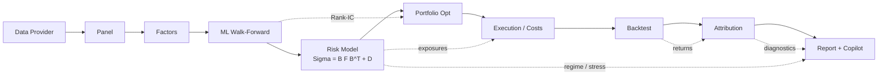

# Architecture

AlphaForge is a linear pipeline of self-contained layers. Each layer consumes the
*real* outputs of the layer before it and the whole thing is orchestrated by
`alphaforge.pipeline.ResearchPipeline`. Optional reporting and diagnostic stages catch failures and record warnings.
A failure in a required data or model stage can still stop the pipeline.

## Pipeline

The CLI, API and dashboard call the same pipeline and consume `ResearchState`.
Matching configuration, data, dependency versions and run dates are still required
when comparing outputs from different entry points.

## Layers

### 1. Data (`alphaforge.data`)
A provider returns a long, canonical price/fundamental table. `DataPipeline`
persists it and hands a bundle to the next stage. The bundled `sample` provider
is fully synthetic but point-in-time, so it carries a survivorship-bias
disclaimer rather than pretending otherwise.

### 2. Panel (`alphaforge.features.panel`)
`build_panel` pivots the long table into **wide** (dates × symbols) panels with
a single, guaranteed-aligned shape: `close`, `returns`, `volume`,
`market_cap`, `industry`, `universe`. Returns are computed from *adjusted*
prices; forward returns lag by the execution window so a signal can only ever be
traded after it exists.

### 3. Factors (`alphaforge.factors`)
A registry of factor functions produces (dates × symbols) panels. A
`FactorPreprocessor` winsorizes, standardizes and industry/size-neutralizes;
`evaluate_factor` reports Rank-IC / ICIR. Neutralisation reduces linear industry and size exposure; it does not guarantee
that factors are independent or free of redundant information.

### 4. Models (`alphaforge.models`)
`AlphaModelPipeline` runs walk-forward CV (expanding window, purge + embargo) and
returns out-of-sample predictions plus an evaluation summary. The alpha is
converted to expected returns via Grinold's fundamental law
(`implied_expected_returns`).

### 5. Risk (`alphaforge.risk`)
`FundamentalRiskModel.fit` estimates `Σ = B F Bᵀ + D` on a rolling window. The
Euler decomposition `σ_p = Σ w_i · MCR_i` has a reconciliation test for modeled
portfolio volatility.

### 6. Portfolio (`alphaforge.portfolio`)
`PortfolioConstructor` turns scores → expected returns → target weights. The
optimizer supports five methods; when the QP is infeasible it walks a
relaxation ladder (vol ceiling → budget → penalized industry slack) instead of
silently returning garbage.

### 7. Execution (`alphaforge.execution`)
`CostModel` prices commission + slippage + square-root market impact;
`BrokerSimulator` applies it and rescales the budget when a name is untradeable.

### 8. Backtest (`alphaforge.backtest`)
`BacktestEngine` is a pure accounting loop. Signals are generated on the
rebalance date from data available *then*; orders execute `execution_lag_days`
later. Delisted names are force-liquidated only after a grace window — dropping
them earlier would inject an undeclared survivorship bias.

### 9. Attribution (`alphaforge.attribution`)
`brinson_attribution` explains active return by *where* you were (sectors);
`factor_attribution` explains it by *what risk* you ran (styles). They are
complements, not substitutes.

### 10. Report + Copilot (`alphaforge.reporting`, `alphaforge.agents`)
`build_html` embeds every figure as base64 — one file, no external assets. The
research copilot applies fixed rules to the real tool outputs and writes a
briefing; if an LLM is configured it only prose-ifies an already-grounded brief.

## Reproducibility contract

`ResearchPipeline.run` applies `project.seed` to Python and NumPy global
randomness and passes it to the synthetic provider and models (unless
`model.seed` is explicitly set). Compare numerical outputs with matching data,
configuration and dependency versions. Reports include a timestamp. The default
copilot applies fixed rules to tool outputs; optional LLM prose requires separate
review. See [the sample manifest](sample-run.md).
