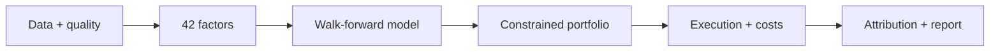

# Research you can inspect

<div class="hero" markdown>

## From a data panel to a portfolio report

AlphaForge is a Python research toolkit connecting factor evaluation,
walk-forward prediction, constrained portfolios, execution costs and attribution.
The CLI, FastAPI service and Streamlit dashboard use the same research pipeline.

[Open the sample report](sample/research_report.html){ .md-button .md-button--primary }
[Reproduce it](sample-run.md){ .md-button }

</div>

!!! note "Synthetic data, computed results"
    The published example uses the bundled synthetic provider. Its metrics demonstrate
    the software and the effects of its assumptions. They are not evidence of a
    market anomaly or an investable strategy.

## Explore the system

| Start here | What you can inspect |
| --- | --- |
| [Sample run](sample-run.md) | Actual metrics, daily returns, configuration, dependency versions and source hashes |
| [Quickstart](quickstart.md) | Local installation, one-command research run, API and dashboard |
| [Architecture](architecture.md) | The stages and shared state connecting data to reports |
| [Validation](validation.md) | Automated checks, interpretation limits and remaining work |

## A complete research path



- **Read the data assumptions.** [Data & Quality](modules/data.md) describes provider behavior and survivorship limits.
- **Understand the signal.** [Factor Research](modules/factor_research.md) and [Portfolio Optimization](modules/portfolio_optimization.md) explain the measurements and constraints.
- **Follow the cash.** [Backtesting](modules/backtesting.md) describes execution timing, cash accounting and modeled costs.
- **Inspect explanations.** The [Research Copilot](modules/ai_agent.md) defaults to deterministic summaries of pipeline outputs, with no paid API required.

## Reproduce locally

```bash
git clone https://github.com/dev-belly/alphaforge.git
cd alphaforge
python -m venv .venv
source .venv/bin/activate
pip install -e ".[viz]"
python scripts/publish_sample.py
```

The example opens directly from `docs/sample/research_report.html`.
See the [recorded environment and outputs](sample-run.md) before comparing numbers.
